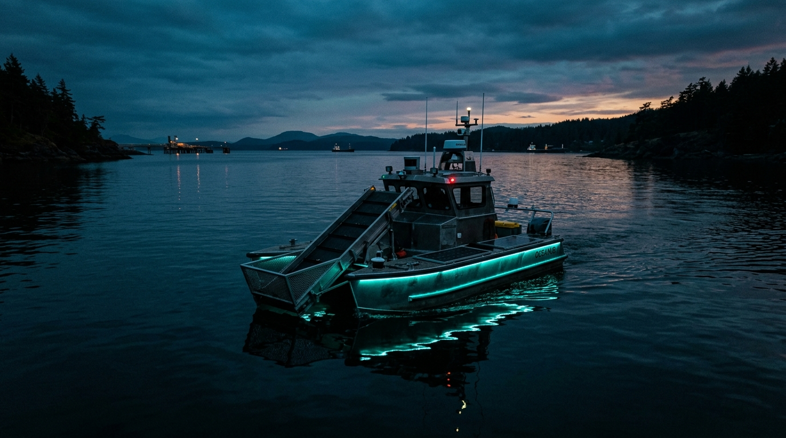
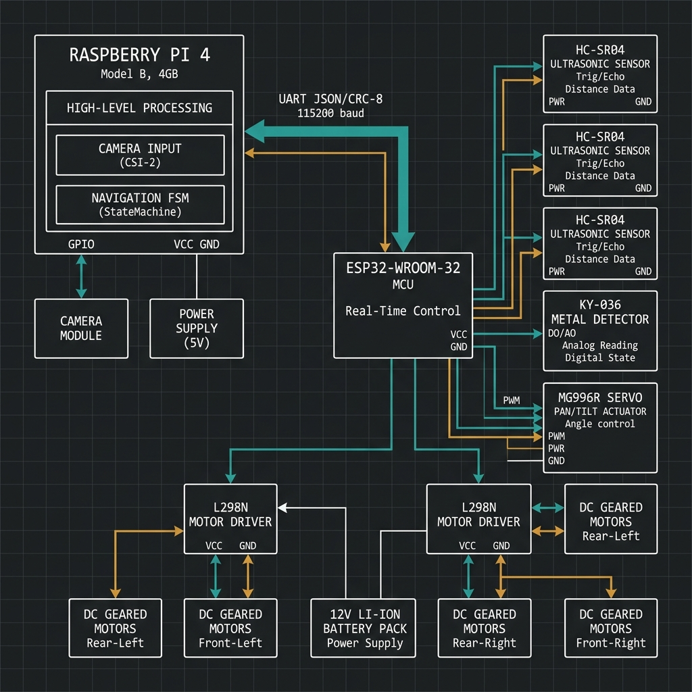
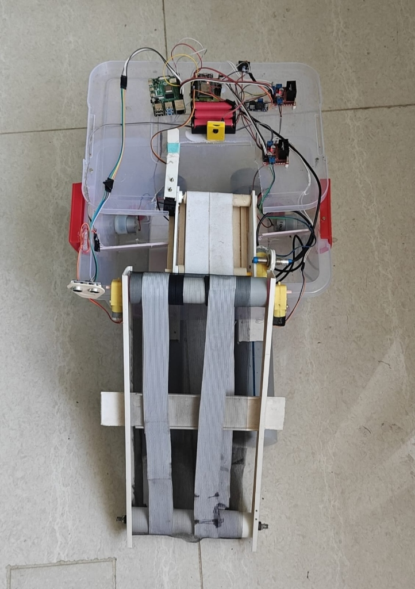
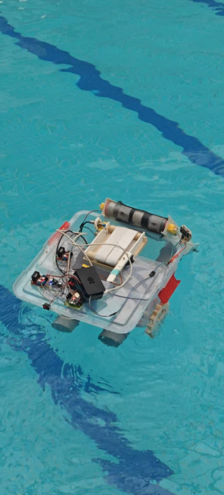
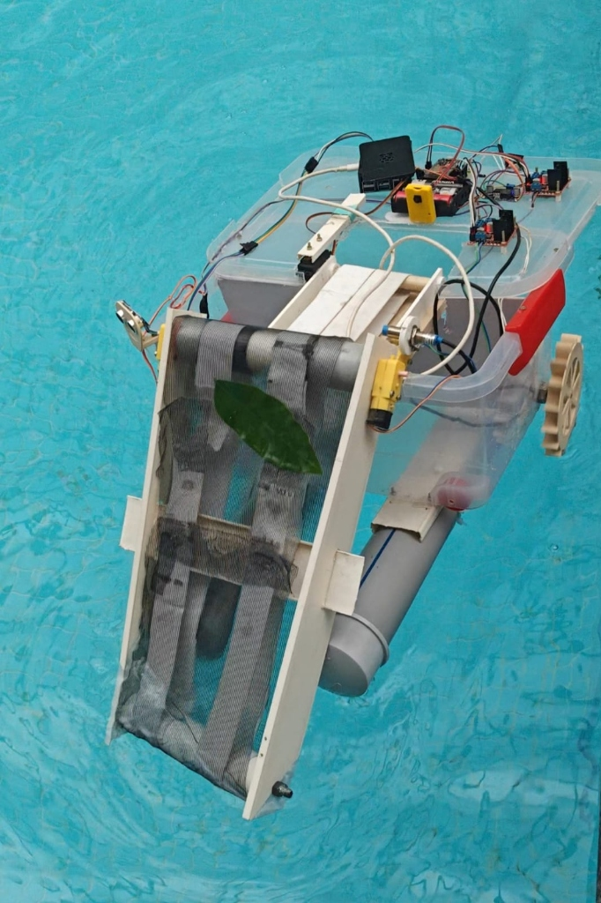

# Autonomous Water Cleaning Robot - Digital Twin
> An interactive digital twin of a surface water cleaning robot with onboard waste classification.

[](https://reactjs.org/)
[](https://threejs.org/)
[](https://opensource.org/licenses/MIT)

## Overview
Urban waterways are increasingly choked by floating solid waste. While most USVs (Unmanned Surface Vehicles) collect debris, they fail to classify it, capping recyclable material recovery at around 43% without onboard sorting capabilities. This digital twin represents an autonomous water-cleaning platform that bridges this critical gap by performing real-time inductive metal segregation directly on the water.

## Validated Performance
The physical prototype of this system was validated across 12 statistically powered swimming-pool trials, yielding the following results:

| Metric | Result |
|---|---|
| Waste segregation accuracy | 94.5 ± 1.6% |
| Debris collection efficiency | 87.9 ± 3.2% |
| Collection throughput | 1.23 kg/hr |
| Obstacle avoidance success | 95.6 ± 2.1% |
| Inter-processor control latency | 8.2 ± 1.4 ms |
| Mission endurance | 52.3 ± 8.1 min (737 m²/mission) |
| Recycling value recovery vs. baseline | 2.9× |
| Areal coverage rate vs. baseline | 3.4× |

## Features
- **Interactive 3D Procedural Model:** A 1:1 scale representation of the physical prototype, built using primitive geometries to maintain high performance.
- **Exploded View Analysis:** Separate the components along the Y-axis to inspect internal architecture, propulsion, and segregation mechanisms.
- **Simulated Telemetry:** A live dashboard showing simulated data for battery consumption, RPM, speed, and real-time waste collection counts.
- **Waste Detection Simulation:** Visualizes the robot's dynamic behavior when encountering floating surface waste (scanning, approaching, collecting).
- **Responsive & Performant:** Built with React Three Fiber and heavily optimized to sustain 60fps on mid-range devices.

## System Snapshot


**Hardware Specifications:**
- **Platform Dimensions:** 88×41×34 cm, 3.75 kg displacement
- **Conveyor:** 47×22 cm, 28° incline
- **Sensors:** KY-036 inductive sensor, MG996R sorting servo, 4× HC-SR04 ultrasonic array
- **Control Architecture:** Raspberry Pi 4 paired with ESP32-WROOM-32 (UART / JSON / CRC-8)
- **Power:** 10 Ah 12V LiPo battery, 38.4 W average draw

## Gallery
<table>
  <tr>
    <td></td>
    <td></td>
    <td></td>
  </tr>
</table>

## Tech Stack
- **Frontend Framework:** React 19 + Vite
- **3D Rendering:** Three.js, `@react-three/fiber`, `@react-three/drei`
- **Styling:** TailwindCSS v4
- **State Management:** Zustand
- **Animations:** Framer Motion

## Folder Structure
```
robotics-website/
├── src/
│   ├── components/       # 2D UI Components (Hero, Dashboard, Content)
│   ├── store/            # Zustand state management (useStore.js)
│   ├── three/            # 3D Components (RobotModel, Scene)
│   ├── App.jsx           # Main Application layout
│   └── index.css         # Tailwind configuration & global styles
├── public/               # Static assets
└── package.json          # Dependencies and scripts
```

## Running Locally

1. **Install Dependencies:**
   ```bash
   npm install
   ```

2. **Start Development Server:**
   ```bash
   npm run dev
   ```

3. **Build for Production:**
   ```bash
   npm run build
   ```
   The static assets will be output to the `dist/` directory, ready to be deployed to Vercel, Netlify, or GitHub Pages.

## Roadmap
- [ ] Implement AI object detection
- [ ] Add swarm capabilities

## Citation
*Publication pending. Please check back for the official DOI and citation format.*

## License
MIT License
