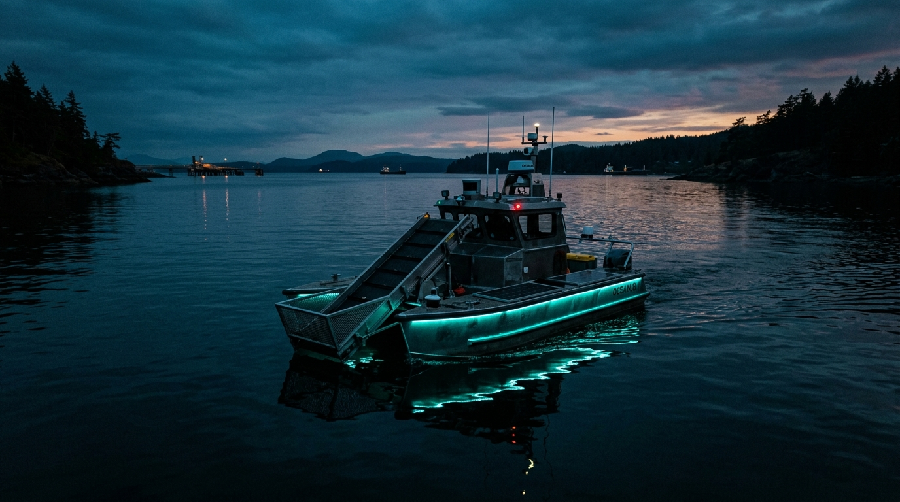
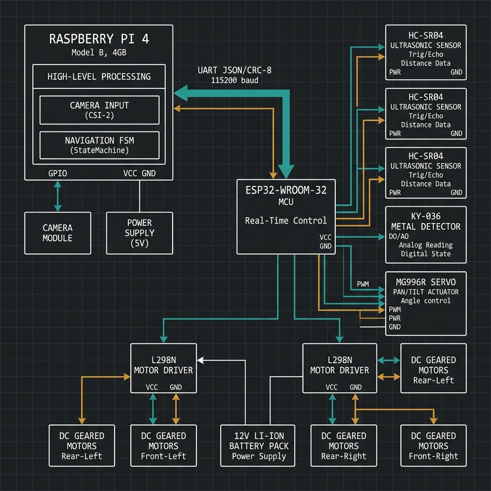
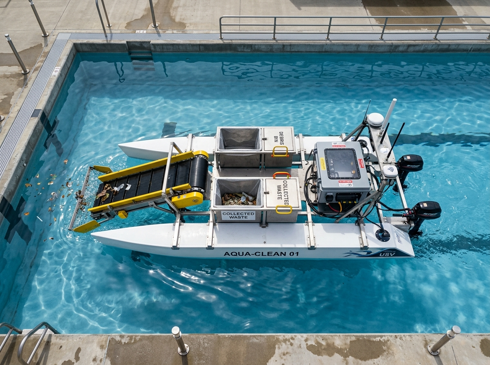
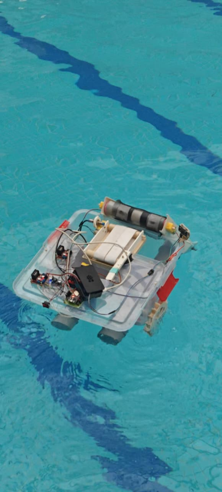
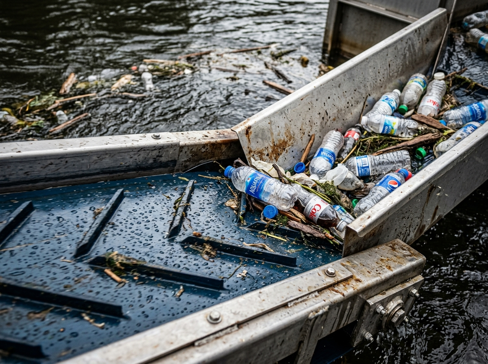

# Autonomous Water Cleaning Robot - Digital Twin
> An interactive digital twin of a surface water cleaning robot with onboard waste classification, real-time telemetry, and interactive system architecture.

[](https://reactjs.org/)
[](https://threejs.org/)
[](https://watercleaning-robot.vercel.app)
[](https://opensource.org/licenses/MIT)

## Overview
Urban waterways are increasingly choked by floating solid waste. While most USVs (Unmanned Surface Vehicles) collect debris, they fail to classify it, capping recyclable material recovery at around 43% without onboard sorting capabilities. This digital twin represents an autonomous water-cleaning platform that bridges this critical gap by performing real-time inductive metal segregation directly on the water.

## Validated Performance
The physical prototype of this system was validated across 12 statistically powered swimming-pool trials, yielding the following results:

| Metric | Result |
|---|---|
| Waste segregation accuracy | 94.5 ± 1.6% |
| Debris collection efficiency | 87.9 ± 3.2% |
| Collection throughput | 1.23 kg/hr |
| Obstacle avoidance success | 95.6 ± 2.1% |
| Inter-processor control latency | 8.2 ± 1.4 ms |
| Mission endurance | 52.3 ± 8.1 min (737 m²/mission) |
| Recycling value recovery vs. baseline | 2.9× |
| Areal coverage rate vs. baseline | 3.4× |

## Key Features
- **Interactive 3D Digital Twin:** A 1:1 scale procedural model of the catamaran vessel featuring dual pontoon hulls, paddle wheels, dual conveyor elevator systems, and dual sorted bins.
- **Interactive System Architecture & Workflow Modals (Fig. 2a):** Every tool and subsystem block in the signal & power architecture diagram (Raspberry Pi 4, ESP32 hub, Li-Ion/Power bank supplies, L298N drivers, motors, ultrasonic/camera/metal sensors, sorting servo, and collection bins) is interactively clickable. Clicking any node opens a technical modal detailing its operational role, key functions, hardware parameters, and signal connections.
- **Realistic Multi-Type Aquatic Debris Simulation:** Dynamically renders diverse river pollutants including crushed beverage cans, plastic bottles, snack wrappers, foam containers, organic river weeds, leaves, and driftwood.
- **Interactive Pause & Simulation Controls:** Live pause/play control toggle allows freezing robot motion and water drift for detailed inspection without resetting session state.
- **Exploded View Analysis:** Dynamically separates internal mechanical and electrical assemblies along the Y-axis to inspect internal conveyor gears, battery compartments, and segregation chutes.
- **Real-Time Telemetry Dashboard:** Monitors live battery discharge, thruster RPM, cruising speed, and metal vs. non-metal collection counts.
- **Fully Responsive Architecture:** Built with React 19, Three.js, and TailwindCSS v4 with full touch, mouse, and keyboard accessibility.

## System Snapshot


### Core Hardware Specifications & Pinout Map

| Subsystem | Hardware Component | Interface / Protocol | Operating Rating | Primary Function |
|---|---|---|---|---|
| **Central Compute** | Raspberry Pi 4 Model B | MIPI CSI-2 / UART (115200 baud) | 5.1V DC / 3.0A | High-level YOLOv8-nano vision detection & path planning |
| **Microcontroller** | ESP32-WROOM-32 | 16-ch LEDC PWM / SAR ADC | 3.3V Logic / 5V VIN | Real-time PID motor drive & sensor interrupt reflex |
| **Material Sensing** | KY-036 Inductive Coil | Analog / TTL Interrupt (< 2ms) | 5V DC | Electromagnetic metallic debris identification |
| **Waste Segregation** | MG996R Metal Gear Servo | 50 Hz PWM (1000–2000 µs) | 6.0V DC / 11 kg-cm | 0.17s mechanical diverter flipper gate actuation |
| **Obstacle Avoidance** | 4× HC-SR04 Ultrasonic | GPIO Trigger / Echo pulses | 5V DC / 40 kHz | 360° perimeter obstacle avoidance (95.6% reliability) |
| **Elevator Intake** | 12V DC Planetary Gear Motor | L298N Dual H-Bridge Channel A | 12V DC / 60 RPM | 47×22 cm inclined mesh conveyor collection drive |
| **Transfer Belt** | 12V DC Precision Gear Motor | L298N Dual H-Bridge Channel B | 12V DC / 0.12 m/s | 18×14 cm secondary metal scanning conveyor drive |
| **Vessel Propulsion** | 2× High-Torque Paddle Wheels | L298N Dual H-Bridge #2 | 12V DC / 0.85 m/s | Differential cruising, station-keeping & zero-turn yaw |
| **Actuator Power** | 3S2P Li-Ion Battery Pack | 20A continuous discharge / BMS | 11.1V – 12.6V / 5.2 Ah | High-current isolated rail for 4 DC motors & servo |
| **Compute Power** | Dedicated USB-C Power Bank | Galvanically isolated rail | 5.1V DC / 3.1A / 20 Ah | Clean surge-protected supply preventing SBC brownouts |
| **Storage Bins** | Dual Perforated ABS Bins | Gravity chute discharge | 2× 2.5 kg / 22.5L each | Fast-draining segregated metal & non-metal storage |

## Gallery
<table>
  <tr>
    <td></td>
    <td></td>
    <td></td>
  </tr>
</table>

## Tech Stack
- **Frontend Framework:** React 19 + Vite
- **3D Rendering:** Three.js, `@react-three/fiber`, `@react-three/drei`
- **Styling:** TailwindCSS v4
- **State Management:** Zustand
- **Animations:** Framer Motion

## Folder Structure
```
robotics-website/
├── src/
│   ├── components/       # 2D UI Components (Hero, Dashboard, Content)
│   ├── store/            # Zustand state management (useStore.js)
│   ├── three/            # 3D Components (RobotModel, Scene)
│   ├── App.jsx           # Main Application layout
│   └── index.css         # Tailwind configuration & global styles
├── public/               # Static assets
└── package.json          # Dependencies and scripts
```

## Running Locally

1. **Install Dependencies:**
   ```bash
   npm install
   ```

2. **Start Development Server:**
   ```bash
   npm run dev
   ```

3. **Build for Production:**
   ```bash
   npm run build
   ```
   The static assets will be output to the `dist/` directory, ready to be deployed to Vercel, Netlify, or GitHub Pages.

## Roadmap
- [ ] Implement AI object detection
- [ ] Add swarm capabilities

## Citation
*Publication pending. Please check back for the official DOI and citation format.*

## License
MIT License
